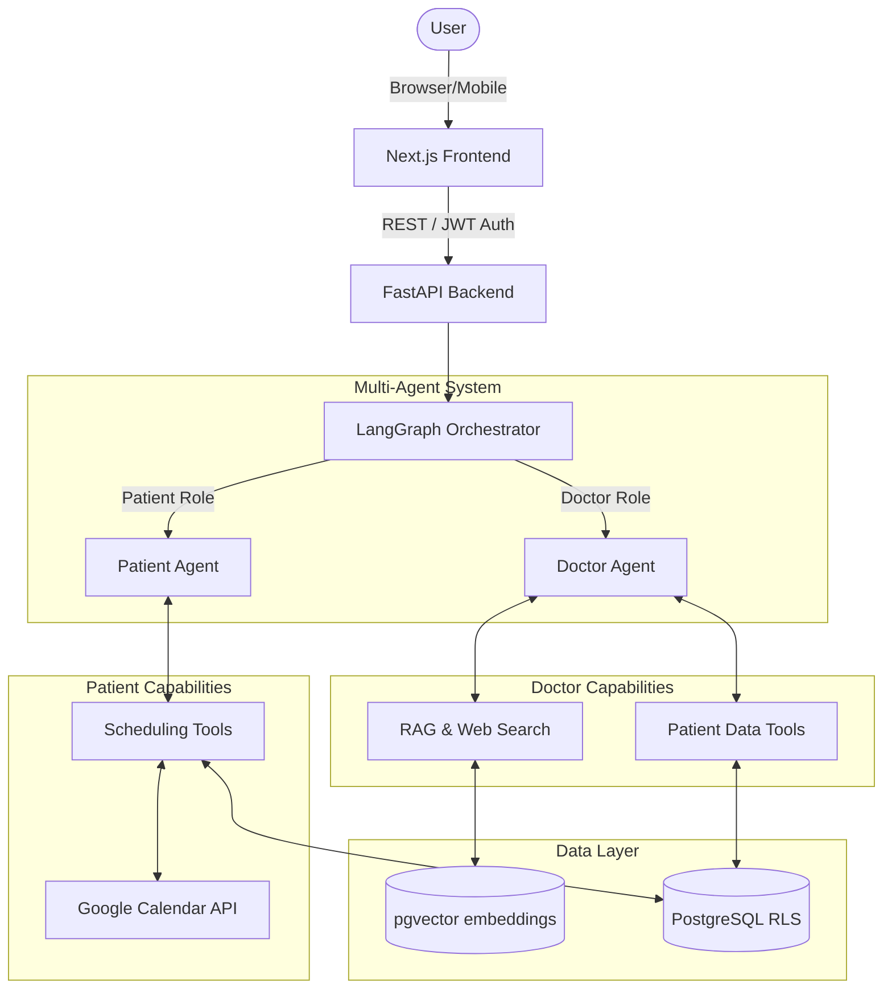

# Medipal: Multi-Agent Medical Assistant

[](https://deepwiki.com/4d4mj/graduation-new-may)

Medipal is an advanced, multi-agent medical application built for my graduation project. It leverages state-of-the-art Large Language Models (LLMs), Retrieval-Augmented Generation (RAG), and a sophisticated agent orchestration framework to provide tailored, secure, and intelligent assistance for both patients and healthcare professionals.

## 🌟 Overview

The platform introduces a dual-agent system where the experience and capabilities are fundamentally shaped by the user's role:

*   **Patient Agent**: Acts as a clinic concierge. It securely helps patients schedule, modify, and cancel appointments while strictly adhering to safety guardrails that prevent it from providing unauthorized medical advice.
*   **Doctor Agent**: Serves as a clinical co-pilot. It has access to RAG for querying internal medical guidelines, web search for up-to-date clinical literature, and secure database tools to query patient records, schedules, and perform bulk administrative actions.

## ✨ Key Features

### 🏥 For Patients
*   **Intelligent Scheduling**: Book, reschedule, or cancel clinic appointments using natural language.
*   **Doctor Discovery**: Search for doctors by name, specialty, or by describing symptoms (the agent infers the appropriate specialty).
*   **Strict Safety Guardrails**: The agent is programmed to recognize when medical advice is being sought and politely redirects the patient to schedule an appointment with a human doctor.
*   **Real-time Availability**: Checks live clinic schedules to find free slots.

### 🩺 For Doctors
*   **Clinical RAG System**: Ask complex medical questions. The agent queries an internal vector database of medical documents, falling back to web search if the confidence score is low.
*   **Patient Context Retrieval**: Securely query demographic data, allergy information, and appointment history for patients under the doctor's care.
*   **Schedule Management**: Ask "What is my schedule for today?" or perform bulk operations like "Cancel all my appointments for tomorrow" (which includes safety confirmation steps).
*   **Calendar Integration**: Automatically syncs appointments and cancellations with Google Calendar.
*   **Administrative Queries**: Securely check personal financial summaries and salary information.

## 🛠️ Technology Stack

*   **Backend framework**: Python, FastAPI
*   **Agent Orchestration**: LangGraph, LangChain
*   **LLM Provider**: Google Gemini (`gemini-2.5-flash-preview-04-17`)
*   **Database**: PostgreSQL with `pgvector` for embeddings
*   **ORM & Migrations**: SQLAlchemy, Alembic
*   **Frontend**: Next.js, React, TailwindCSS, shadcn/ui
*   **Containerization**: Docker, Docker Compose

## 🏗️ Architecture

Medipal uses a stateful multi-agent architecture:



1.  **FastAPI Backend**: Exposes endpoints for the Next.js frontend to communicate with the agents.
2.  **LangGraph**: Manages the conversational state and tool-calling loops for the agents. It uses `MemorySaver` for checkpointing.
3.  **Tool Calling**: Agents are equipped with specific Python functions (tools) that allow them to interact with the PostgreSQL database, Google Calendar API, and Vector Store.
4.  **Row-Level Security (RLS)**: The database schema is designed with security in mind, ensuring doctors can only access data for their assigned patients.

## 📋 Prerequisites

Before you begin, ensure you have the following installed:
1.  **Docker and Docker Compose**: Install from [Docker's official website](https://www.docker.com/products/docker-desktop/).
2.  **Make**: 
    *   *Windows*: `choco install make`
    *   *macOS*: `brew install make`
    *   *Linux*: `sudo apt-get install make`

## 🚀 Getting Started

### 1. Clone the Repository
```bash
git clone https://github.com/4d4mj/graduation-new-may.git
cd Graduation-new
```

### 2. Environment Configuration
Create a `.env` file in the project root directory. You can copy the contents of `.env.example` if it exists.

Example `.env` file content:
```env
# Backend Application Settings
GOOGLE_API_KEY=your_google_genai_api_key_here
COHERE_API_KEY=your_cohere_api_key_here # For RAG reranking
DATABASE_URL=postgresql+asyncpg://user:password@db:5432/medipal
```

### 3. Running the Application
Use the provided `Makefile` to build and start all services in development mode:
```bash
make dev
```
*(This runs `docker-compose -f compose.yml -f compose.dev.yml up --build -d` under the hood).*

To stop the application:
```bash
make down
```

### 4. Database Migrations
Once the database container is running, apply the Alembic migrations to create the schema:
```bash
# Enter the backend container
make backend

# Run migrations
alembic upgrade head

# Exit the container
exit
```

### 5. Seeding Data
Populate the database with initial doctors, patients, and vector embeddings for the RAG system:
```bash
# Enter the backend container
make backend

# Seed doctors and basic data
python scripts/seed_doctors.py
python scripts/seed_database.py

# Ingest medical documents for the Doctor Agent's RAG
python scripts/ingest_data.py

exit
```

## 💻 Usage Guide

Once the application is running, you can access the different interfaces:

*   **Frontend Web App**: `http://localhost:3000`
*   **Backend API Documentation (Swagger)**: `http://localhost:8000/docs`

### Example Interactions

**Logging in as a Patient:**
1. Tell the agent: *"I have a sharp pain in my chest."*
2. The agent will empathetically acknowledge the symptom, refuse to diagnose it (safety guardrail), and suggest booking an appointment with a Cardiologist.
3. Follow the prompts to select a doctor, pick a time, and confirm the booking.

**Logging in as a Doctor:**
1. Ask the agent: *"What is my schedule for today?"*
2. The agent will fetch and display your appointments.
3. Ask a clinical question: *"What are the standard side effects of Metformin?"*
4. The agent will query the internal vector store (RAG) and provide an answer citing the source documents.

## 📂 Project Structure

*   `/backend`: FastAPI application, LangGraph agent definitions, tools, database models, and Alembic migrations.
*   `/frontend`: Next.js application, React components, and UI styling.
*   `/docker`: Docker configuration files and database initialization scripts.
